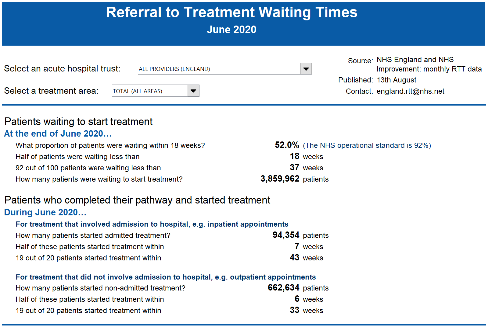

# Consultant-led Referral to Treatment Waiting Times

#### Project Status: [In progress]

## Project Description and data sources

This pipeline is being developed to automatically web-scrape the latest releases of [NHS England's waiting times datasets](https://www.england.nhs.uk/statistics/statistical-work-areas/rtt-waiting-times/rtt-data-2018-19/) and use the raw data to produce summary statistics which in the first instance mirror those produced in their monthly dashboards ([see example for July 2020 here](https://www.england.nhs.uk/statistics/wp-content/uploads/sites/2/2020/09/Download-Waiting-Times-by-Hospital-Trust-XLS-5900K-Jul20.xls)).

In addition, this data pipeline allows to produce descriptive statistics:

* At the provider or commmissioning CCG level
* According to whether the provider is independent or not
* According to the commissioning CCG's level of deprivation based to the 2019 IMD ([produced by MCHLG](https://data-communities.opendata.arcgis.com/datasets/8247db94b3ad4237950806fd53563dd3_0))
* According to the commissioning CCG's region (based on an [ONS lookup](https://geoportal.statistics.gov.uk/datasets/clinical-commissioning-group-to-nhs-england-region-local-office-and-nhs-england-region-april-2019-lookup-in-england))

## How does it work?

* The code in **'1a. Clean deprivation and regional lookup data.R'** downloads and cleans the regional deprivation data as well as the geographical lookup tables, making these files fit for purpose.
* The code in **'1b. Scrape links to RTT files and download and append and clean.R'** web-scrapes the URLs of our required monthly datasets on waiting times from the [NHS England website](https://www.england.nhs.uk/statistics/statistical-work-areas/rtt-waiting-times/rtt-data-2018-19/).

For example, for the month of April 2020, we download:

- 'RTT-APRIL-2020-full-extract': this file contains a row for each combination of provider (e.g. Guy's and St Thomas' NHS Foundation Trust), specialty (e.g. General Surgery) and pathway status (waiting to start, started admitted or started non-admitted). Each row summarises the distribution of waiting times for the relevant patients (e.g. how many patients are waiting between 0-1 weeks, 1-2 weeks, etc.).
- 'Apr20-newproviders', 'Apr20-providers-admitted', 'Apr20-providers-nonadmitted' : These three files allow us to identify, each month, which providers are flagged as independent (e.g. private clinics).

* The code in **'2. Produce descriptive statistics.R'** allows us to generate the following monthly descriptive statistics:

At the provider level:

- Total number of patients waiting to start by specialty
- Total number of patients started by specialty (split by admitted and non-admitted)
- The median number of weeks waited by patients, as well as the 95th and 92nd quantiles (these are national statistics)
- The percentage of patients below national waiting targets

At the comissioning CCG level:

- Same statistics as above, split by whether providers are independent or not
- Same statistics as above, split by IMD decile (10 levels) and quintile (5 levels)
- Same statistics as above, split by NHS England region

### Requirements

These scripts were written in R version 4.0.2 and RStudio Version 1.1.383. 
The following R packages (available on CRAN) are needed: 
* [**tidyverse**](https://www.tidyverse.org/)
* [**plyr**]
* [**readODS**]
* [**data.table**]
* [**rgdal**]
* [**readxl**]
* [**varhandle**]
* [**RSelenium**]
* [**seleniumPipes**]
* [**rvest**]
* [**downloader**]
* [**readr**]

The list above is non exhaustive, but each of the individual .R codes in this repository indicates which packages are needed.

## Authors

* Sebastien Peytrignet - [@SebastienPeytr2] - [GitHub](speytrignet-thf)
* Karen Hodgson - [@SebastienPeytr2] - [GitHub](speytrignet-thf)

## License

This project is licensed under the [MIT License](https://opensource.org/licenses/MIT).

## Acknowledgments

NHS England and NHS Digital, who have provided the raw data and notes on methodology on their respective websites.
